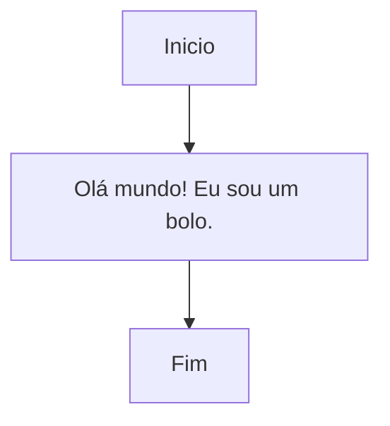
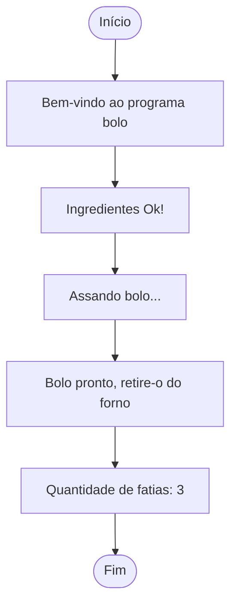

# Fundamentos C parte 3: aplicando a linguagem C na prática

> ATENÇÃO
> 
> 1. Não seja trapaceira(o): jamais utilize um código que você não sabe como funciona ou não sabe explicar;
> 2. Faça as suas anotações: utilize esse doc quando não estiver com as suas anotações; a qualidade do seu raciocínio é insubstituível;
> 3. Peça ajuda: se precisar de ajuda procure os Campers da vila43, faremos de tudo para te ajudar; não se sinta sozinho, tamo junto e misturado;
> 4. Bons estudos!

---
## Programa `main.c`

- FLUXO DE TRABALHO
	- criar um arquivo
	- escrever o programa
	- compilar o programa
	- executar o programa
	- conferir o resultado (testar)


- Diagrama de bloco: a estrutura do nosso programa




- criar um arquivo

```shell
touch main.c
```

- escrever o programa

```C
//programa main.c
#include <stdio.h>

int main(void)
{
	printf("Olá mundo! Eu sou um bolo.");
}
```

- compilar o programa

```shell
gcc main.c
```

- executar o programa

```shell
./a.out
```

- conferir o resultado (testar)

```shell
Olá mundo! Eu sou um bolo.
```


---
## Vamos atualizar nosso programa `main.c`

- Diagrama de bloco: a nova estrutura do nosso programa



- atualizar nosso arquivo

```c
//programa main.c
#include <stdio.h>

int main(void)
{
	int ovo_qt;
	int leite_ml;
	int massa;

	ovo_qt = 2;
	leite_ml = 1;

	printf("Bem-vindo ao programa BOLO :D \n");
	printf("Ingredientes Ok!\n");
	
	massa = ovo_qt + leite_ml;

	printf("Assando bolo...\n");
	printf("Bolo pronto, retire-o do forno!\n");
	printf("Quantidade de fatias: %d\n", massa);
}
```

- compilar o programa

```shell
gcc main.c
```

- executar o programa

```shell
./a.out
```

- conferir o resultado (testar)

```shell
Bem-vindo ao programa BOLO :D
Ingredientes OK!
Assando o bolo...
Bolo pronto, retire-o do forno!
Quantidade de fatias: 3
```
