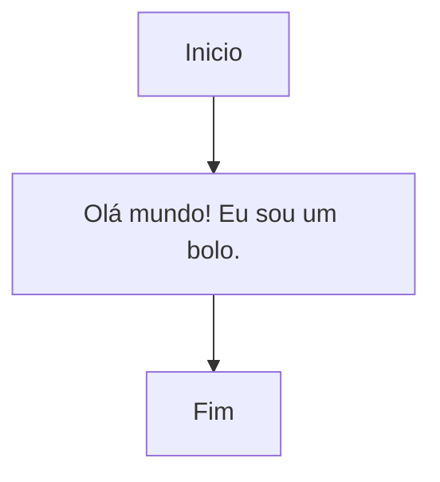
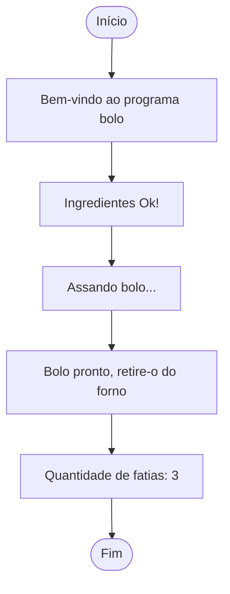

# Fundamentos de C em Pseudocódigo parte1

> ATENÇÃO
> 
> 1. Não seja trapaceira(o): jamais utilize um código que você não sabe como funciona ou não sabe explicar;
> 2. Faça as suas anotações: utilize esse doc quando não estiver com as suas anotações; a qualidade do seu raciocínio é insubstituível;
> 3. Peça ajuda: se precisar de ajuda procure os Campers da vila43, faremos de tudo para te ajudar; não se sinta sozinho, tamo junto e misturado;
> 4. Bons estudos!


### Algoritmos e Programas

***Ou como preparar um bolo com o seu PC***

---
#### Algoritmo: receita de um bolo

- Tema:
	- Algoritmo: o que é;
	- Etapas de processamento;

```
Algoritmo: Receita de bolo

1. Início;
2. Verificar se há ingredientes;
3. Misturar ingredientes;
4. Preparar forma;
5. Colocar os ingredientes na forma;
6. Assar a massa no forno a 180°c por 40 min;
7. Retirar bolo;
8. Comer uma fatia;
9. Fim
```


#### Programa: bolo_v1.0

- FLUXO DE TRABALHO
	- criar um arquivo
	- escrever o programa
	- compilar o programa
	- executar o programa
	- conferir o resultado (testar)


- Diagrama de bloco: a estrutura do nosso programa




- criar um arquivo

```shell
touch receita_bolo_v1.0
```

- escrever o programa

```stylus
//programa receita_bolo_v1.0
#link <biblio_entrada_saida.h>

INICIO
	// declar + inic
	escreva "Olá mundo! Eu sou um bolo."
FIM
```

- compilar o programa

```shell
gcc receita_bolo_v1.0
```

- executar o programa

```shell
./a.out
```

- conferir o resultado (testar)

```shell
Olá mundo! Eu sou um bolo.
```


#### Programa: bolo_v2.0

- Diagrama de bloco: a estrutura do nosso programa v2.0



- criar um arquivo

```shell
touch receita_bolo_v2.0
```

```stylus
//programa receita_bolo_v2.0
#link <utencilios_cozinha.h>
#link <biblioteca_entrada_saida.h>

INICIO
	// declar + inic
	ingred   ovo_qt;
	ingred   leite_ml;
	ingred   massa;

	ovo_qt = 2;
	leite_ml = 1;

	// proc
	escreva "Bem-vindo ao programa BOLO :D "
	escreva "Ingredientes Ok!"
	
	massa = ovo_qt + leite_ml;

	escreva "Assando bolo..."
	escreva "Bolo pronto, retire-o do forno!"
	escreva ("Quantidade de fatias: {decimal}", massa)
FIM
```

- compilar o programa

```shell
gcc receita_bolo_v2.0
```

- executar o programa

```shell
./a.out
```

- conferir o resultado (testar)

```shell
Bem-vindo ao programa BOLO :D
Ingredientes OK!
Assando o bolo...
Bolo pronto, retire-o do forno!
Quantidade de fatias: 3
```
