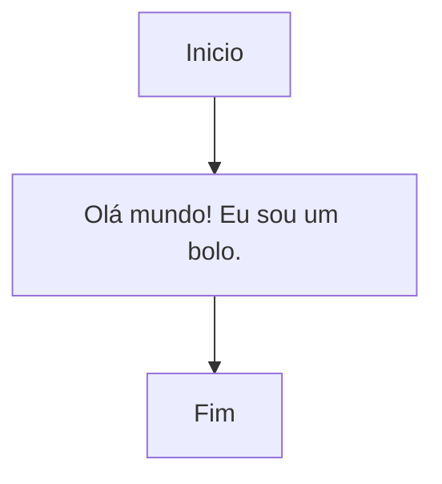
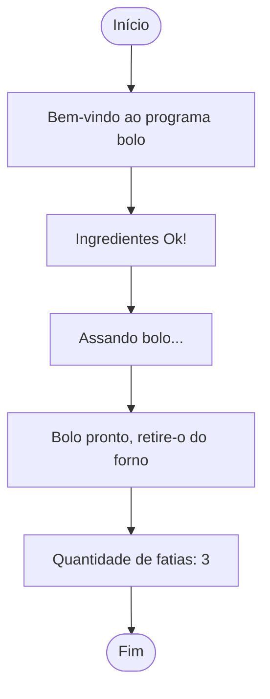

# Fundamentos de C parte 2: Pseudocódigo

> ATENÇÃO
> 
> 1. Não seja trapaceira(o): jamais utilize um código que você não sabe como funciona ou não sabe explicar;
> 2. Faça as suas anotações: utilize esse doc quando não estiver com as suas anotações; a qualidade do seu raciocínio é insubstituível;
> 3. Peça ajuda: se precisar de ajuda procure os Campers da vila43, faremos de tudo para te ajudar; não se sinta sozinho, tamo junto e misturado;
> 4. Bons estudos!

---

## Definição de Pseudocódigo

>Pseudocódigo é uma forma genérica de escrever um algoritmo, utilizando uma linguagem simples.

**FONTE**[wikipedia](https://pt.wikipedia.org/wiki/Pseudoc%C3%B3digo)


## Vamos criar um programa chamado `receita_principal`

- Etapas de Trabalho
	- criar um arquivo
	- escrever o programa
	- compilar o programa
	- executar o programa
	- conferir o resultado (testar)


- Diagrama de bloco: a estrutura do nosso programa




- criar um arquivo

```shell
criar receita_principal
```

- escrever o programa

```stylus
//programa receita_principal
#link <biblio_entrada_saida.h>

INICIO
	escreva "Olá mundo! Eu sou um bolo."
FIM
```

- compilar o programa

```shell
compilar receita_principal
```

- executar o programa

```shell
executar receita_principal
```

- conferir o resultado (testar)

```shell
Olá mundo! Eu sou um bolo.
```


## Vamos aprimorar nosso programa `receita_principal`

- Diagrama de bloco: a nova estrutura do nosso programa





- atualizar o conteúdo do arquivo da seguinte forma

```stylus
//programa receita_principal
#link <utencilios_cozinha.h>
#link <biblioteca_entrada_saida.h>

INICIO
	ingred   ovo_qt;
	ingred   leite_ml;
	ingred   massa;

	ovo_qt = 2;
	leite_ml = 1;

	// processamento
	escreva "Bem-vindo ao programa BOLO :D "
	escreva "Ingredientes Ok!"
	
	massa = ovo_qt + leite_ml;

	escreva "Assando bolo..."
	escreva "Bolo pronto, retire-o do forno!"
	escreva ("Quantidade de fatias: {decimal}", massa)
FIM
```

- compilar o programa

```shell
compilar receita_principal
```

- executar o programa

```shell
executar receita_principal
```

- conferir o resultado (testar)

```shell
Bem-vindo ao programa BOLO :D
Ingredientes OK!
Assando o bolo...
Bolo pronto, retire-o do forno!
Quantidade de fatias: 3
```


